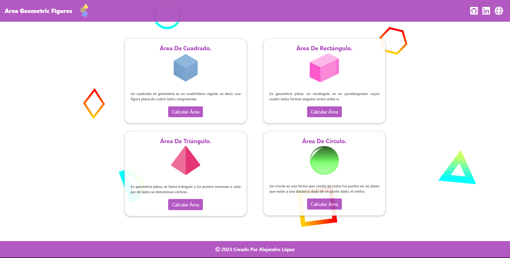

# <h1 align="center" style="color: #80cbc4;"> Area Geometric Figures 👨🏻‍💻 </h1> 
  

` The Area of ​​a Geometric Figure ` is a method to calculate the figures, it is a metric concept that allows assigning a measurement to the extension of a surface, expressed in mathematical units of measurement called surface units. The area is a metric concept that requires that the space where a measurement is defined or indicated. For flat surfaces, the concept is more intuitive
         

  

## 
 Requirements 

- [HTML5](https://developer.mozilla.org/es/docs/Web/HTML) 
- [CSS3](https://developer.mozilla.org/es/docs/Web/CSS)
- [JavaScript](https://developer.mozilla.org/es/docs/Web/JavaScript)
- [BootStrap](https://mdbootstrap.com/)

  

## 
 Screenshot Project 💻 

🔶 [Project Website](https://alejandro-lopez.futuretecware.com/Area-Geometric-Figures/index.html)

